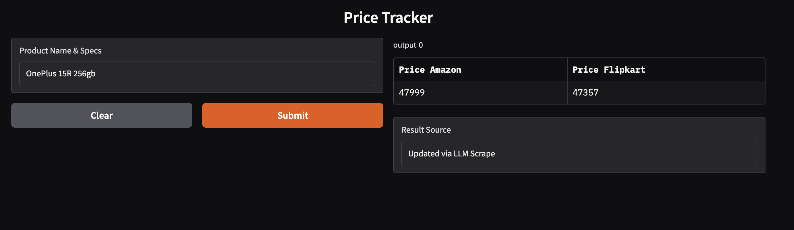
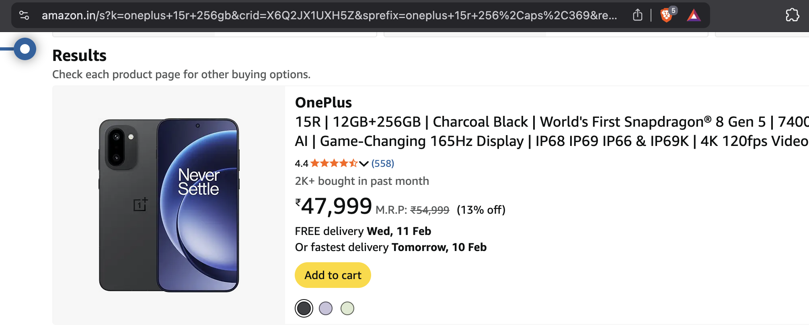
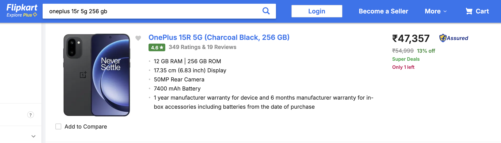
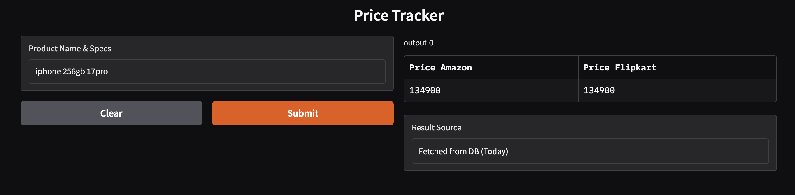
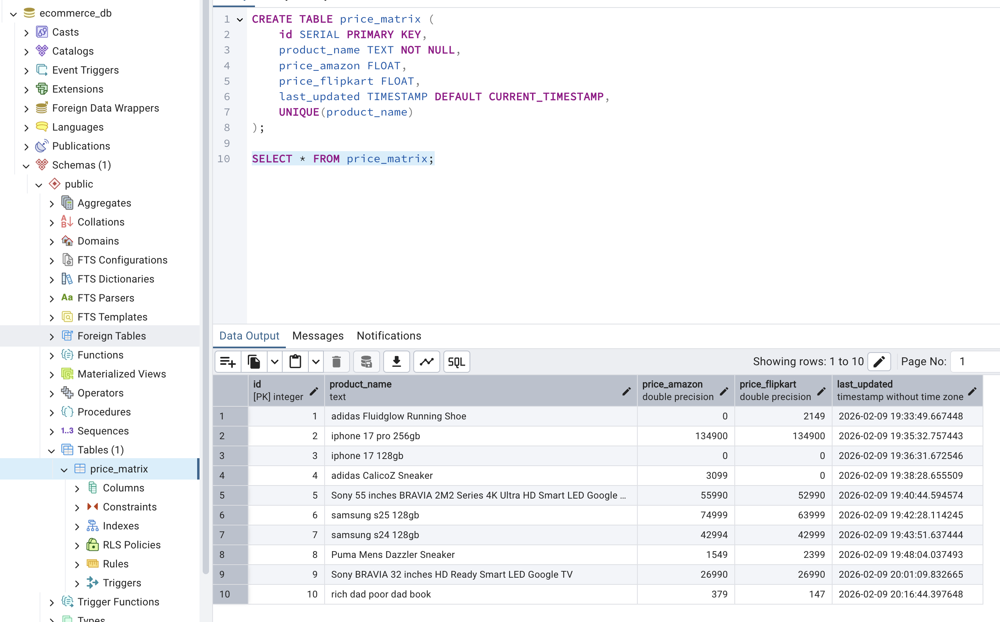

# Project Documentation: AI powered Price Tracker

## 1. Business Objective

To provide a tool that automates price tracking across major e-commerce platforms of Amazon and Flipkart. The system reduces human overhead by autonomously reconciling product variants (entity resolution) and ensures data accuracy by combining raw web scraping with LLM-based verification.

## 2. Script Accomplishments

The script implements a **3-stage Agentic Workflow**:

* **State Management (Cache-First):** Checks a PostgreSQL database to see if a query of product name has a valid price record from the current calendar day, eliminating redundant API costs and scraping delays.
* **Intelligent Entity Resolution:** Uses an LLM to perform fuzzy matching between user queries and existing database entries (e.g., matching "iPhone 15 128GB" with "Apple 128gb iPhone 15").
* **Context-Aware Extraction:** Scrapes raw HTML from Amazon and Flipkart, cleans the noise, and can use **offline and online LLMs** to parse unstructured text into structured JSON data.

## 3. Technical Challenges & Solutions

| Challenge | Technical Solution |
| --- | --- |
| **Unable to detect changes in Variants or Versions** | A very slight change in the model name or variant cannot be identified by the LLMs. The script wasn't able to differentiate between a 55inch and 43inch TV of the same class. |
| **Noise & Token Limits** | Sometimes hallucinations by LLMs can provide unrealistic responses when the token length of scraped webpage exceeds the limit. |

## Screenshots
### Retrieveing results from search, when a new product name is queried.

### Search result from Amazon

### Search result from Flipkart

### Retrieveing results from DB for existing products, even when product name doesnt match exactly.

### Database accumulated by products queried.

